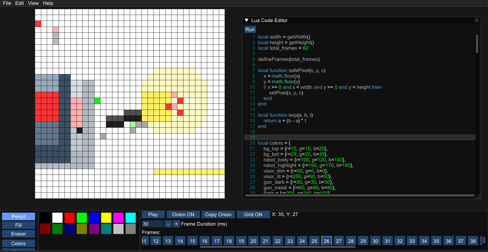

# Flipbook
[](https://github.com/prvnprk/flipbook/actions/workflows/build.yml)



Flipbook is a pixel art animation engine that combines standard drawing tools with a Lua scripting environment. You can draw frame-by-frame animations by hand or use code to generate them procedurally.

Projects are saved in a custom `.pxrt` format, and animations can be exported to GIF, Frame can be exported to PNG.

## Features

**Canvas & Tools**
*   Standard drawing tools: Pencil, Eraser, and Bucket Fill.
*   Customizable color palettes.
*   Zoom in/out and Move Canvas (Pan) for navigation.
*   Grid overlay.
*   Onion Skinning: See a transparent overlay of the previous frame while drawing.
*   Copy Onion: copy previous frame to next one.

**Timeline & Playback**
*   Add and Delete frames.
*   Set specific Frame Duration (in milliseconds) to control timing.
*   Real-time playback.

**System**
*   Built-in Lua Code Editor.
*   Undo functionality.
*   Export to .GIF or .PNG.


***
## Building from Source

To build Flipbook, you need **CMake** and **Visual Studio 2022** (MSVC) installed.

1.  Open a terminal in the project directory.
2.  Configure the project:
    `cmake -B build`
3.  Build the project in Release mode:
    `cmake --build build --config Release`
4.  The executable will be generated in the `build/Release` directory (or `build/` depending on your OS).

***
## Scripting & API Reference

You can automate animation using the built-in code editor. You have access to the standard Lua libraries (math..etc) and the custom functions listed below.

### Setup Rules
To initialize a script correctly, you must call these functions in this specific order at the top of your code:
1.  `defineCanvas(width, height)`
2.  `defineFrames(total_frames)`

### API Functions

**Initialization**
*   `defineCanvas(width, height)`: Initializes the canvas. Width and height must be non-negative. Call this first.
*   `defineFrames(total_frames)`: Initializes the animation buffer size. Call this second.

**Drawing & State**
*   `setPixel(x, y, color_table)`: Draws a single pixel. The `color_table` must specify RGB values using keys. Example: `{r=255, g=0, b=0}`.
*   `getPixel(x, y)`: Returns a table containing the color data of a pixel.
*   `getWidth()`: Returns the canvas width.
*   `getHeight()`: Returns the canvas height.
*   `setFrameDelay(delay_ms)`: Sets the delay for the current frame in milliseconds.
*   `setCurrentFrame(frame_index)`: Targets a specific frame to draw on (1-based index).
*   `copyRegion(x, y, w, h)`: Copies pixels from the current frame into an internal buffer. Coordinates must be positive.
*   `pasteRegion(x, y)`: Pastes the clipboard contents onto any frame at (x, y).
*   `moveRegion(x, y, w, h, target_x, target_y)`: Moves a block of pixels from one location to another within the current frame.

***

## Example Script

Here is a simple script to create a moving dot animation on a 32x32 canvas.
```lua
-- 1. Initialize
local w = 32
local h = 32
defineCanvas(w, h)

-- 2. Set total frames
local frames = 15
defineFrames(frames)

-- 3. Draw Loop
for i = 1, frames do
    setCurrentFrame(i)
    
    -- Clear background to black
    for x = 0, w-1 do
        for y = 0, h-1 do
            setPixel(x, y, {r=0, g=0, b=0})
        end
    end
    
    -- Draw a red pixel moving to the right
    local x_pos = i * 2
    setPixel(x_pos, 16, {r=255, g=0, b=0})
    
    -- Set speed
    setFrameDelay(100)
end
```

---

## Animation Showcase

    


## Contributors

*   [Praveen P](https://github.com/prvnprk)
*   [Pramodgouda V K](https://github.com/Pramod1831)
*   [Latesh Shetty](https://github.com/Lateshshetty)
